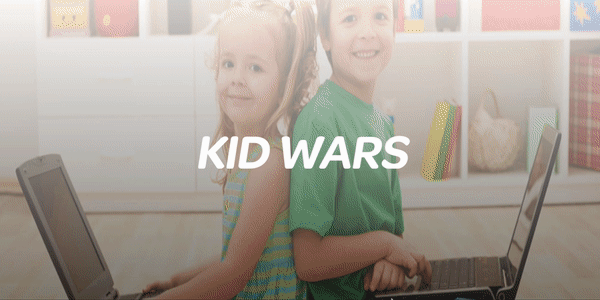
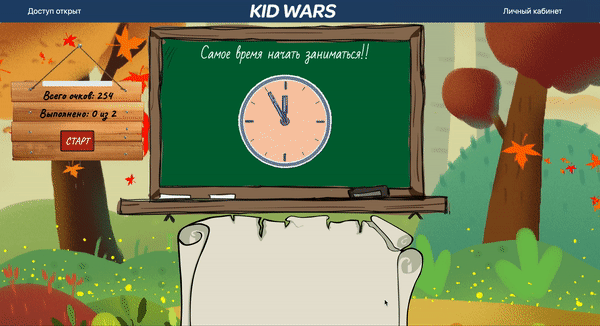
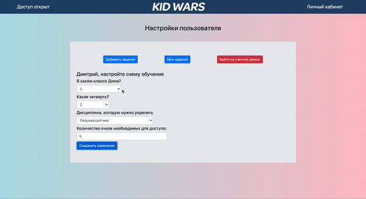

# KID WARS

Приложение создано для помощи родителям в обучении детей.

Основной функционал - блокировка доступа к ресурсам ПК до тех пор пока ребенок не выполнит необходимые задания.
Можно добавлять собственные задания и выбирать схему обучения.
Есть телеграм бот для доп. контроля за процессом.

Для ребенка ребенка и родителя были предусмотрены разные интерфейсы.

### Для ребенка:

### Для родителя:

Запуск программы: 
>В корне, папках frontend и backend выполнить yarn.
> В одном терминале выполнить dev-server
> Во втором терминале выполнить dev-client

Используемые технологии: HTML, CSS, Bootstrap, React, Redux, React-animation, Node js, Express, Mongoose, Electron, Telegram Bot API и другие.

